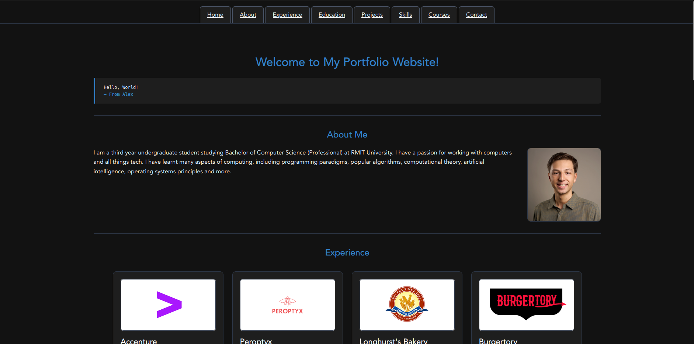
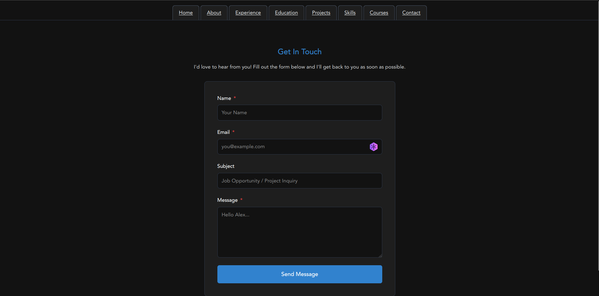

# Personal Portfolio Website
## Overview
My personal portfolio website project. Uses my portfolio database, which contains data about me. It runs a series of queries to do lookups to render the data on the website. Initially manually ran SQL scripts to create tables and insert values, but this can be modified to use Java to read CSV files and create tables and insert values in the database.




## Technical Specification
To build and run the code locally, JDK 25+ is required. If an earlier version must be used, replace the `void main()` signature with `public static void main(String[] args)` in `App.java:24`. If using most IDE maven plugins, the libraries are automatically downloaded and can run from IDE. Otherwise, maven is required to download the libraries and build the application.

To build and run the code remotely, docker engine is required. If using most IDE dev container plugins, can open a remote dev container and run from IDE. Otherwise, the dev container CLI is required. If only docker must be used, WIP.

## Classes backing Web Pages
```
PageIndex.java                              - Homepage
PageContact.java                            - Contact page
PageContactSubmit.java                      - Form handler
```

## Other Classes
```
App.java                                    - Main Application entrypoint
Course.java                                 - Course information loader
DateTimeUtils.java                          - Date and time formatter
Education.java                              - Education information loader
ErrorUtils.java                             - Error renderer
Experience.java                             - Experience information loader
JDBCConnection.java                         - Database connecter
Project.java                                - Project information loader
Skill.java                                  - Skill information loader
```

## Folders
```
personal-website/
├── .devcontainer/
│   ├── devcontainer.json                   - Configure dev container
│   └── Dockerfile                          - Configure docker image
├── .vscode/
│   ├── java-formatter.xml                  - IDE formatter
│   └── settings.json                       - IDE settings
├── database/
│   ├── AboutMe.db                          - SQLite database
│   ├── *.csv                               - Exported tables
│   └── *.sql                               - Setup tables scripts
├── src/main/
│   ├── java/com/alexd/app/
│   │   └── *.java                          - Java source files
│   └── resources/
│       ├── public/
│       │   ├── css/
│       │   │   └── style.css               - User interface styling
│       │   └── images/
│       │       └── *.png                   - Project images
│       └── templates/
│           └── *.html                      - User interface markup
├── target/                                 - Generated build directory
├── .gitignore                              - Ignore maven files
├── LICENSE                                 - GPL-3.0 licence
├── README.md                               - Documentation
└── pom.xml                                 - Configure build
```

## Libraries
* org.xerial.sqlite-jdbc (SQLite Java Database Connectivity)
* io.javalin.
    * javalin (Java web server)
    * javalin-rendering-thymeleaf (HTML template)
* org.slf4.slf4j-simple (Logging)

# Building & Running the Code
## Locally
1. Run `mvn exec:java` in a terminal, which reads the `pom.xml` file, downloads the Java libraries, builds and runs the application.
2. Go to: http://localhost:7001/

## Remotely using a Dev Container
Start docker engine, then run these commands in a terminal:
1. `devcontainer up --workspace-folder .` which builds and runs the Docker container in `.devcontainer/Dockerfile`.
2. `devcontainer exec --workspace-folder . mvn exec:java` which builds and runs the application inside the container.
3. Go to: http://localhost:7001/

# Author
`alexd-ev` (Alex Davidson)

Copyright Alex Davidson (c) 2026
